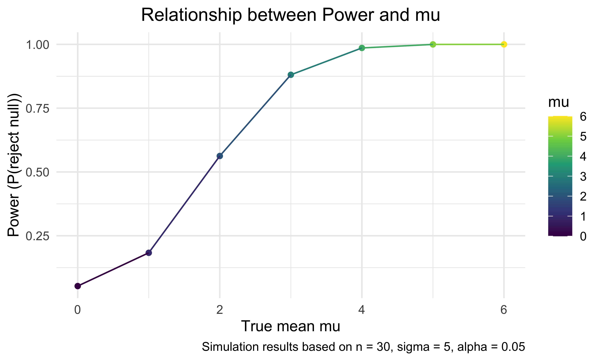

Iteration HW
================
Bohan Zhu
2025-10-30

``` r
library(tidyverse)
```

    ## ── Attaching core tidyverse packages ──────────────────────── tidyverse 2.0.0 ──
    ## ✔ dplyr     1.1.4     ✔ readr     2.1.5
    ## ✔ forcats   1.0.0     ✔ stringr   1.5.1
    ## ✔ ggplot2   4.0.0     ✔ tibble    3.3.0
    ## ✔ lubridate 1.9.4     ✔ tidyr     1.3.1
    ## ✔ purrr     1.1.0     
    ## ── Conflicts ────────────────────────────────────────── tidyverse_conflicts() ──
    ## ✖ dplyr::filter() masks stats::filter()
    ## ✖ dplyr::lag()    masks stats::lag()
    ## ℹ Use the conflicted package (<http://conflicted.r-lib.org/>) to force all conflicts to become errors

## Problem 1: Same Birthday

Write the function

``` r
bday_sim = function(n_room){
  
  birthdays = sample(1:365, n_room, replace = TRUE)
  
  repeated_bday = length(unique(birthdays)) < n_room 
  
  repeated_bday

}
```

Do the simulation

``` r
bday_sim_results = 
  expand_grid(
    bdays = 2:50,
    iter = 1:10000
  ) |> 
  mutate(
    result = map_lgl(bdays, bday_sim)
  ) |> 
  group_by(
    bdays
  ) |> 
  summarize(
    prob_repeat = mean(result)
  )
```

plot this

``` r
bday_sim_results |> 
  ggplot(aes(x = bdays, y = prob_repeat)) +
  geom_point() +
  geom_line()
```


## Problem 2 : Power in one sample t-test

Write the function

``` r
t_test = function(mu){
  
  x = rnorm(30, mean = mu, sd = 5)
  broom::tidy(t.test(x, mu = 0, alternative = "two.sided")) |> 
    rename(mu_hat = estimate) |> 
    select(mu_hat, p.value)
  
}
```

Do the simulation

``` r
t_test_results = 
  expand_grid(
    mu = 0:6,
    iter = 1:50
  ) |> 
  mutate(
    result = map(mu, t_test)
  ) |> 
  group_by(
    mu
  ) |> 
  unnest(result)
```

### mu vs. power

``` r
mu_power = 
  t_test_results |> 
  summarize(power = mean(p.value < 0.05))

mu_power |> 
  ggplot(aes(x = mu, y = power, color = mu)) +
  geom_point() +
  labs(
    x = "True mean mu",
    y = "Power (P(reject null))",
    title = "Relationship between Power and mu",
    caption = "Simulation results based on n = 30, sigma = 5, alpha = 0.05 "
  ) +
  theme(
    legend.position = "right",
    plot.title = element_text(hjust = 0.5)
    )
```



## Problem 3

``` r
homicides_df = 
  read_csv("data/homicide-data.csv")
```

    ## Rows: 52179 Columns: 12
    ## ── Column specification ────────────────────────────────────────────────────────
    ## Delimiter: ","
    ## chr (9): uid, victim_last, victim_first, victim_race, victim_age, victim_sex...
    ## dbl (3): reported_date, lat, lon
    ## 
    ## ℹ Use `spec()` to retrieve the full column specification for this data.
    ## ℹ Specify the column types or set `show_col_types = FALSE` to quiet this message.

Inner part

``` r
birthdays = sample(1:365, 5, replace = TRUE)

repeated_bday = length(unique(birthdays)) < 5 # if repeat, TRUE. No repeat,FALSE.
repeated_bday
```

``` r
bday_sim(20)
```
