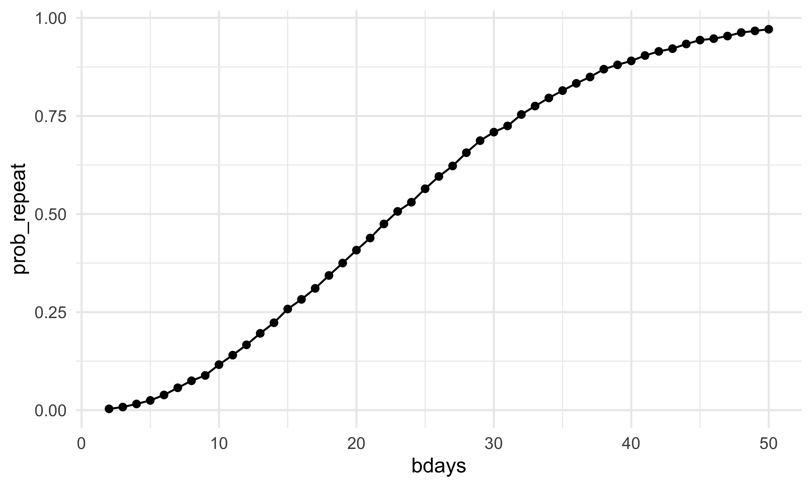
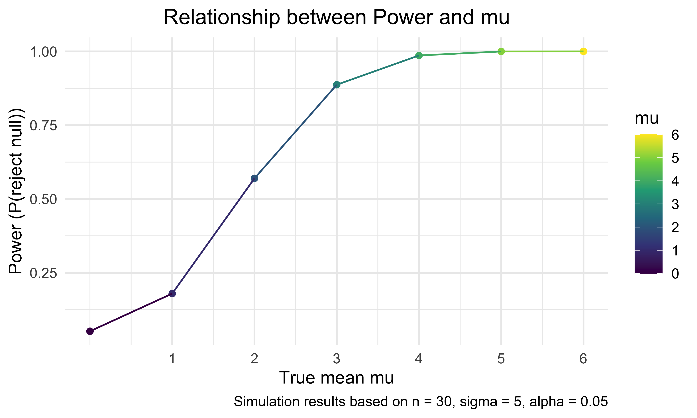
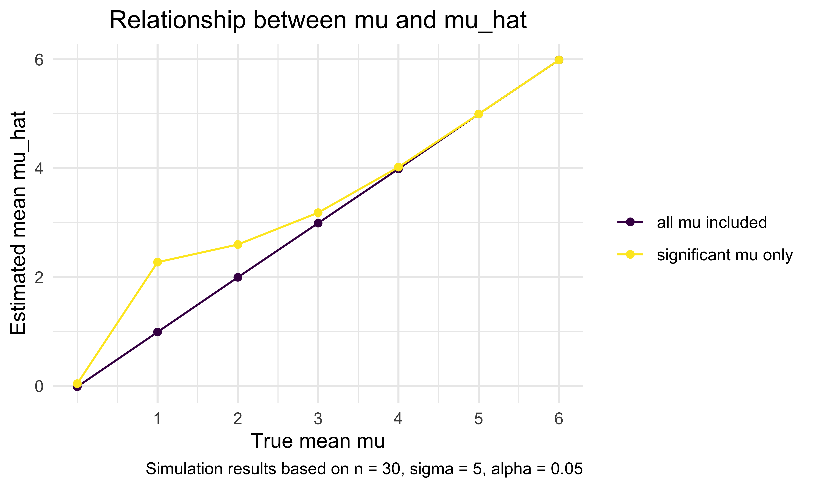

Iteration HW
================
Bohan Zhu
2025-10-30

``` r
library(tidyverse)
```

    ## ── Attaching core tidyverse packages ──────────────────────── tidyverse 2.0.0 ──
    ## ✔ dplyr     1.1.4     ✔ readr     2.1.5
    ## ✔ forcats   1.0.0     ✔ stringr   1.5.1
    ## ✔ ggplot2   4.0.0     ✔ tibble    3.3.0
    ## ✔ lubridate 1.9.4     ✔ tidyr     1.3.1
    ## ✔ purrr     1.1.0     
    ## ── Conflicts ────────────────────────────────────────── tidyverse_conflicts() ──
    ## ✖ dplyr::filter() masks stats::filter()
    ## ✖ dplyr::lag()    masks stats::lag()
    ## ℹ Use the conflicted package (<http://conflicted.r-lib.org/>) to force all conflicts to become errors

``` r
set.seed(123)
```

## Problem 1: Same Birthday

Write the function

``` r
bday_sim = function(n_room){
  
  birthdays = sample(1:365, n_room, replace = TRUE)
  
  repeated_bday = length(unique(birthdays)) < n_room 
  
  repeated_bday

}
```

Do the simulation

``` r
bday_sim_results = 
  expand_grid(
    bdays = 2:50,
    iter = 1:10000
  ) |> 
  mutate(
    result = map_lgl(bdays, bday_sim)
  ) |> 
  group_by(
    bdays
  ) |> 
  summarize(
    prob_repeat = mean(result)
  )
```

plot this

``` r
bday_sim_results |> 
  ggplot(aes(x = bdays, y = prob_repeat)) +
  geom_point() +
  geom_line()
```



## Problem 2 : Power in one sample t-test

Write the function

``` r
t_test = function(mu){
  
  x = rnorm(30, mean = mu, sd = 5)
  broom::tidy(t.test(x, mu = 0, alternative = "two.sided")) |> 
    rename(mu_hat = estimate) |> 
    select(mu_hat, p.value)
  
}
```

Test for $\mu = 0$ only.

``` r
t_test_results = 
  expand_grid(
    mu = 0,
    iter = 1:5000
  ) |> 
  mutate(
    result = map(mu, t_test)
  ) |> 
  group_by(mu) |> 
  unnest(result)

t_test_results
```

    ## # A tibble: 5,000 × 4
    ## # Groups:   mu [1]
    ##       mu  iter mu_hat p.value
    ##    <dbl> <int>  <dbl>   <dbl>
    ##  1     0     1 -0.424  0.642 
    ##  2     0     2  1.34   0.220 
    ##  3     0     3 -1.85   0.0246
    ##  4     0     4 -0.759  0.373 
    ##  5     0     5 -1.03   0.259 
    ##  6     0     6  0.502  0.521 
    ##  7     0     7  0.442  0.573 
    ##  8     0     8 -0.539  0.593 
    ##  9     0     9 -0.293  0.739 
    ## 10     0    10  0.955  0.271 
    ## # ℹ 4,990 more rows

Do the simulation for all $\mu$

``` r
t_test_results = 
  expand_grid(
    mu = 0:6,
    iter = 1:5000
  ) |> 
  mutate(
    result = map(mu, t_test)
  ) |> 
  group_by(mu) |> 
  unnest(result)
```

plot 1: $\mu$ vs. power

``` r
mu_power = 
  t_test_results |> 
  summarize(power = mean(p.value < 0.05))

mu_power |> 
  ggplot(aes(x = mu, y = power, color = mu)) +
  geom_point() +
  geom_line() +
  scale_x_continuous(breaks = 1:6) +
  labs(
    x = "True mean mu",
    y = "Power (P(reject null))",
    title = "Relationship between Power and mu",
    caption = "Simulation results based on n = 30, sigma = 5, alpha = 0.05"
  ) +
  theme(
    legend.position = "right",
    plot.title = element_text(hjust = 0.5)
    )
```



There is a clear positive association between the effect size (the true
mean $\mu$) and the power of the one-sample t-test.

When $\mu$ is close to 0, the test rarely rejects the null hypothesis
because the sample mean does not differ much from 0. As $\mu$ increases,
the separation between the true mean and the null value grows, making it
easier for the test statistic to exceed the critical threshold. As a
result, the probability of rejecting the null hypothesis increases
steadily.

In short, larger effect sizes produce higher power, approaching 1 when
the true mean is sufficiently far from 0.

plot 2: $\mu$ vs. $\hat {\mu}$

``` r
mu_summary_all <-
  t_test_results |>
  group_by(mu) |> 
  summarize(avg_mu_hat = mean(mu_hat))

mu_summary_sig <-
  t_test_results |>
  group_by(mu) |> 
  filter(p.value < 0.05) |>
  summarize(
    avg_mu_hat_sig = mean(mu_hat)
    )

mu_summary <-
  left_join(mu_summary_all, mu_summary_sig, by = "mu")
```

``` r
mu_summary |> 
  ggplot(aes(x = mu)) +
  geom_point(aes(y = avg_mu_hat, color = "all mu included")) +
  geom_line(aes(y = avg_mu_hat, color = "all mu included")) +
  geom_point(aes(y = avg_mu_hat_sig, color = "significant mu only")) +
  geom_line(aes(y = avg_mu_hat_sig, color = "significant mu only"), 
            linetype = "dashed") +
  scale_x_continuous(breaks = 1:6) +
  labs(
    title = "Relationship between mu and mu_hat", 
    x = "True mean mu", 
    y = "Estimated mean mu_hat",
    caption = "Simulation results based on n = 30, sigma = 5, alpha = 0.05",
    color = ""
    ) +
  theme(
    legend.position = "right",
    plot.title = element_text(hjust = 0.5)
    )
```



From the plot, the overall average of $\hat{\mu}$ for all samples
matches the true $\mu$. This is expected, because the sample mean is an
unbiased estimator of $\mu$, under the normal model.

However, when we restrict attention only to samples where the null
hypothesis was rejected, the average $\hat{\mu}$ is noticeably higher
than the true $\mu$, especially for small values of $\mu$ (see $\mu$
that are less than 2). This happens because rejection at $\alpha= 0.05$
selects samples where the sample mean deviates far enough from 0 to
trigger significance. In other words, we are conditioning on a rare
event that disproportionately includes samples with large positive
deviations.

This selection creates an upward bias, making $\hat{\mu}$ appear larger
than the truth. As $\mu$ increases and power approaches 1, almost all
samples reject the null, so the bias gradually disappears

## Problem 3 Homicides

``` r
homicides = 
  read_csv("data/homicide-data.csv", na = c("NA",".","")) |> 
  janitor::clean_names() 
```

    ## Rows: 52179 Columns: 12
    ## ── Column specification ────────────────────────────────────────────────────────
    ## Delimiter: ","
    ## chr (9): uid, victim_last, victim_first, victim_race, victim_age, victim_sex...
    ## dbl (3): reported_date, lat, lon
    ## 
    ## ℹ Use `spec()` to retrieve the full column specification for this data.
    ## ℹ Specify the column types or set `show_col_types = FALSE` to quiet this message.

The datasets `homicide_data` summaries on homicides in 50 large U.S.
cities. There are 12 variables and 52179cases. Variables are uid,
reported_date, victim_last, victim_first, victim_race, victim_age,
victim_sex, city, state, lat, lon, disposition.

Important variables include `uid`, a unique identifier for each
case.`victim_age` which is useful for studying age-related patterns.
`state` and `city` aims to supports regional comparisons and is key for
city-level trand and clearance analysis. And `disposition` which
indicates whether the homicide was solved or remains unsolved.

There is one error case where city `Tulsa` was miss-categorized to state
`AL`.

``` r
homicides_df =
  homicides |>
  mutate(
    city_state = str_c(city, ", ", state),
    unsolved_homicides = disposition %in% c("Closed without arrest", "Open/No arrest")
  ) |>
  group_by(city_state) |>
  summarize(
    total_homicides = n(),
    unsolved_homicides = sum(unsolved_homicides)
  ) |>
  ungroup()
```

`prop.test` for `Baltimore, MD` only

``` r
city_prop_test = function(city_state_name) {

  city_chosen =
    homicides_df |>
    filter(city_state == city_state_name)

  prop_test =
    prop.test(
      x = city_chosen |> pull(unsolved_homicides),
      n = city_chosen |> pull(total_homicides)
    )

  
  broom::tidy(prop_test) |>
    select(estimate, conf.low, conf.high) |>
    mutate(city_state = city_state_name) |>
    select(city_state, everything())
}


city_prop_test("Baltimore, MD")
```

    ## # A tibble: 1 × 4
    ##   city_state    estimate conf.low conf.high
    ##   <chr>            <dbl>    <dbl>     <dbl>
    ## 1 Baltimore, MD    0.646    0.628     0.663

`prop.test` for all cities

``` r
city_results =
  homicides_df |>
  mutate(
    prop_test = map2(unsolved_homicides, total_homicides, \(x, y) prop.test(x, y)),
    prop_tidy = map(prop_test, broom::tidy)
  ) |>
  unnest(prop_tidy) |>
  select(city_state, estimate, conf.low, conf.high, total_homicides)
```

    ## Warning: There was 1 warning in `mutate()`.
    ## ℹ In argument: `prop_test = map2(...)`.
    ## Caused by warning in `prop.test()`:
    ## ! Chi-squared approximation may be incorrect

``` r
prop_test_all =
  map_df(homicides_df$city_state, city_prop_test)
```

    ## Warning in prop.test(x = pull(city_chosen, unsolved_homicides), n =
    ## pull(city_chosen, : Chi-squared approximation may be incorrect

``` r
prop_test_all 
```

    ## # A tibble: 51 × 4
    ##    city_state      estimate conf.low conf.high
    ##    <chr>              <dbl>    <dbl>     <dbl>
    ##  1 Albuquerque, NM    0.386    0.337     0.438
    ##  2 Atlanta, GA        0.383    0.353     0.415
    ##  3 Baltimore, MD      0.646    0.628     0.663
    ##  4 Baton Rouge, LA    0.462    0.414     0.511
    ##  5 Birmingham, AL     0.434    0.399     0.469
    ##  6 Boston, MA         0.505    0.465     0.545
    ##  7 Buffalo, NY        0.612    0.569     0.654
    ##  8 Charlotte, NC      0.300    0.266     0.336
    ##  9 Chicago, IL        0.736    0.724     0.747
    ## 10 Cincinnati, OH     0.445    0.408     0.483
    ## # ℹ 41 more rows

``` r
prop_test_all|> 
  mutate(
    city_state = reorder(city_state, estimate)
    ) |> 
  ggplot(aes(x = city_state, y = estimate)) +
  geom_errorbar(aes(ymin = conf.low, ymax = conf.high)) +
    geom_point()+
  theme(axis.text.x = element_text(size = 5,angle = 90))+
  ggtitle("Proportion of unsolved homicides in different cities")
```


The point labeled `Tulsa, AL` is a data error — `Tulsa` is in Oklahoma,
so this entry should be excluded from interpretation.

Excluding that mistake, the plot shows clear differences in the
proportion of unsolved homicides across cities. Most cities fall between
roughly 30% and 55%, with a gradual increase from left to right. A few
cities stand out with substantially higher unresolved rates above
60–70%, indicating consistently higher proportions of cases without
arrest. The confidence intervals are fairly narrow, suggesting
reasonably stable estimates for most cities.
